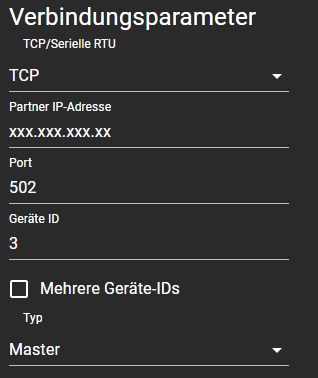
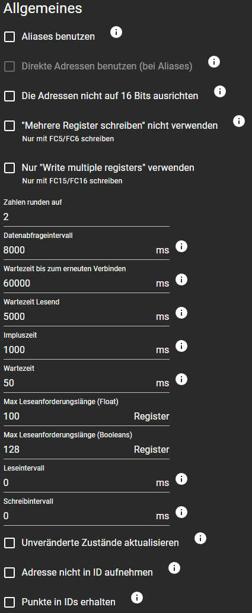
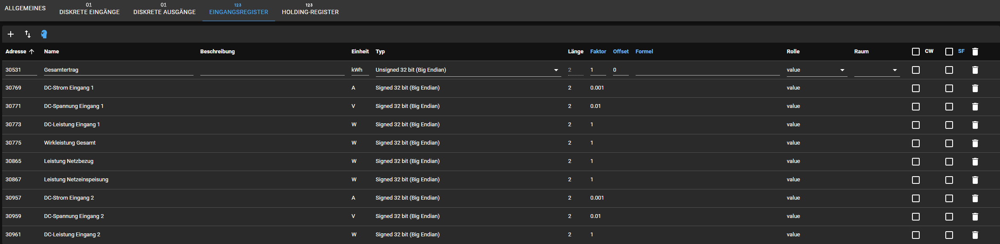

# Charge surplus voltage from your photovoltaic system in combination with a go-e-charger
The content of this folder describes how to set up surplus charging for an electric vehicle.

In this context I will describe the process by using following components:
- Solar system controlled by a [Sunnyboy Tripower inverter](https://www.sma.de/produkte/solar-wechselrichter/sunny-tripower-30-40-50-60)
- [Go-e charger HOMEfix](https://go-e.com/fileadmin/Support/Anleitungen/go-e-charger-homefix-datasheet.pdf)
- [ioBroker](https://iobroker.net/) as controlling platform for smart home projects

You can find details on how to install ioBroker in the root README file.

## Install adapters on ioBroker
First you will have to install different adapters on your ioBroker instance so that we will be able to communicate with our devices. To do that open you ioBroker in a browser and click on **Adapter**. Search for following adapters and install them:
- go-eCharger wallbox integration
- ModBus
- JavaScript script execution

## Setup the adapters
After installing those adapters they will probably open a settings window directly. If not click on **Instances** and then on the adapter specific **wrench** symbol.

### Go-eCharger adapter settings
You don't have to change very much of the default settings of the go-eCharger adapter. You just have to identify the IP adress of your charger in your routers configurations. I would also suggest to define a static IP for your go-eCharger on your routers settings. If you know the right IP adress just insert it and save your configuration. The adapter will restart and it should be able to send data to your iobroker instance. You can play around with the other settings if you like to change the data behavior. For my set up it is important that the API settings are set to v1.
> [!IMPORTANT]  
> Don't forget to allow the usage of HTTP-API v1 and v2 in your go-eCharger app.
> The code uses version 2 to change charging phases because the adapter does not provide this option.

### Modbus adapter settings
To configure the modbus adapter settings is a little more difficult because we have to define every input register you want to read of your inverter. The values might also be different on your inverter if you got a different hardware version than me. You can always refer to one of the [original modbus descriptions](https://www.sma.de/produkte/produktfeatures-schnittstellen/modbus-protokoll-schnittstelle) of SMA if you want to be sure or to read other data.

The following images show the general settings you should configure on the modbus adapter. You can take the same parameter values except for the IP adress. Configure the IP adress as you did in the go-eCharger adapter settings but this time for your inverter.

Please do not configure a value faster than 5000ms in field **Datenabfrageintervall (Data query interval)**. A too fast interval setting might damage your inverter.

### JavaScript
To set up a JavaScript click on the scripts button on the left. Click the + symbol to add a new script and copy-paste the surplus_charging.js script of this repository. Now you have to adjust two parts that are marked with "TODO". The first TODO marks the place where you have to provide the right IP of your go-eCharger. The other TODO is optional. You can set the frequency on how often the script runs its execution. By default the code gets executed every 7 minutes. I do not recommend a higher frequency than 5 minutes.
